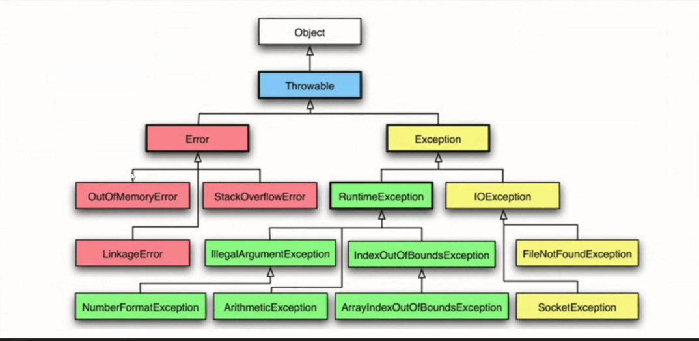

# Исключения в программировании и их обработка (семинары)
## Урок 1. Обработка ошибок в программировании
* Ошибка - неожиданный итог работы программы
* Исключение - прогнозируемая ошибка
Exit code отличный от "0" - это ошибка

Исключеия:
* Проверяевые (зелёные)
* Не проверяемые (IOExeption жёлтые) - JVM обрабатывает исключения самостоятельно



Выделение памяти:
* Процесс(может включать в себя несколько потоков)
* Поток
```
FileWriter fw = new FileWriter(path, true); // true - дозапись к существующему
```