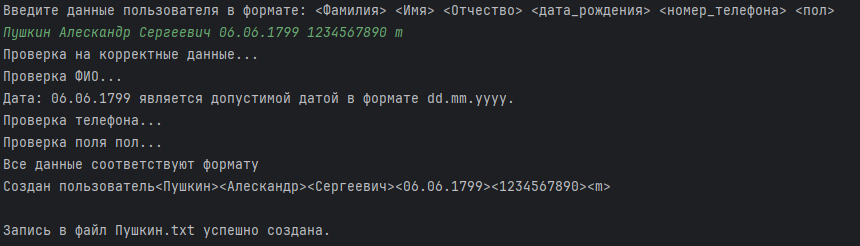

# Исключения в программировании и их обработка (семинары)
## Урок 3. Продвинутая работа с исключениями в Java
Напишите приложение, которое будет запрашивать у пользователя следующие данные, разделенные пробелом:

Фамилия Имя Отчество дата _ рождения номер _ телефона пол

Форматы данных:

фамилия, имя, отчество - строки
дата _ рождения - строка формата dd.mm.yyyy
номер _ телефона - целое беззнаковое число без форматирования
пол - символ латиницей f или m.

Приложение должно проверить введенные данные по количеству. 
Если количество не совпадает, вернуть код ошибки, обработать его и показать пользователю сообщение, что он ввел меньше и больше данных, чем требуется.

Приложение должно распарсить полученную строку и выделить из них требуемые значения. 
Если форматы данных не совпадают, нужно бросить исключение, соответствующее типу проблемы. 
Можно использовать встроенные типы java и создать свои. Исключение должно быть корректно обработано, пользователю выведено сообщение с информацией, что именно неверно.

Если всё введено и обработано верно, должен создаться файл с названием, равным фамилии, в него в одну строку должны записаться полученные данные, вида
<Фамилия> <Имя> <Отчество> <дата _ рождения> <номер _ телефона> <пол>

Однофамильцы должны записаться в один и тот же файл, в отдельные строки.
Не забудьте закрыть соединение с файлом.
При возникновении проблемы с чтением-записью в файл, исключение должно быть корректно обработано, пользователь должен увидеть стектрейс ошибки.

## Решение:



Пример собственного исключения:
```java
MyRunTimeExeption.java 
```

Структура хранения записи
```java
User.java

    String surname;
    String firstname;
    String midname;
    String dataOfBirth;
    String telefonNumber;
    char gender;
```

Проверка на ввод пустой строки и неверного формата ввода (6 строк данных разделённых пробелом) производится в классе Parser:

```java
public class Parser 
```

Собственный класс исключений продемонстрирован:

```java
public class MyRunTimeExeption extends RuntimeException
```
Реализованы проверки:
<Фамилия> - Буквенный ввод, не менее 2х символов
<Имя> - Буквенный ввод, не менее 1го символа(Инициалы)
<Отчество> - Буквенный ввод, не менее 1го символа(Инициалы)
<дата _ рождения> - проверка на формат dd.mm.yyyy, проверка на соответствии диапазонов day, month. Проверка соответствия календарю (Не бывает 31.02.2024).
<номер _ телефона> - цифры, не менее 6 знаков, положительное число.  
<пол> - m или f! (Не зависимо от регистра ввода, Допустимо M и F)

*Программа отрабатывает без исключений:*
```java
Пушкин Алескандр Сергеевич 06.06.1799 1234567890 M

```

При отсутствии исключений - происходит запись в файл <Фамилия>.txt
однофамильцы и дубликаты дописываются в существующий файл.

Реализовано логирование в консоль, для демонстрации процесса работы программы.


