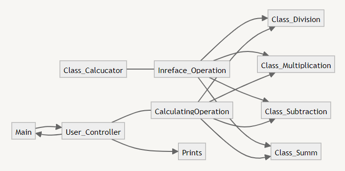
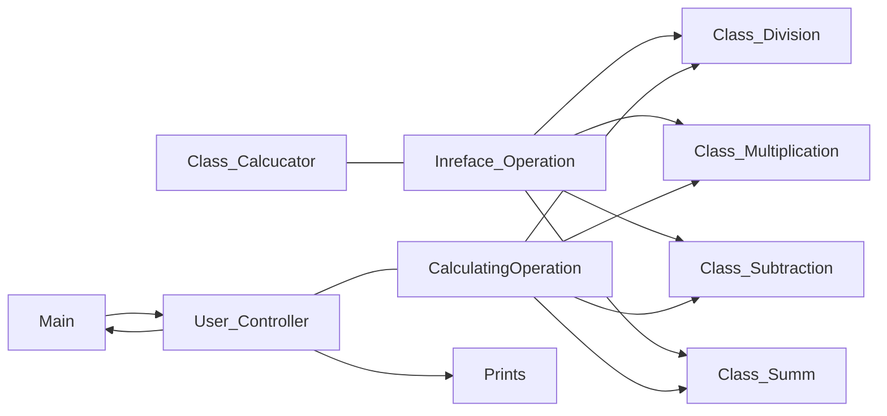
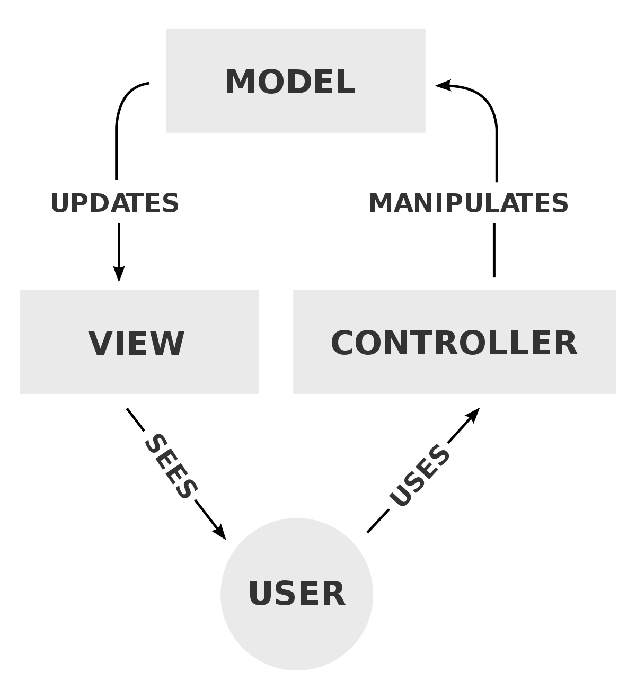

# Объектно-ориентированное программирование (семинары)
## Урок 7. ООП Дизайн и Solid ч.2
Создать проект калькулятора вещественых чисел
* сложение
* умножение
* деление

Применить при создании программы: 
* архитектурные паттерны
* добавить логирование калькулятора
* Соблюдать принципы SOLID, паттерны проектирования.

Можно выбрать другой язык программирования, например C# или Python, если выбран язык, отличный от JAVA, то необходимо написать документ, каким образом можно запустить приложение (что необходимо установить, каким образом запускать и т.п.).

Формат сдачи: ссылка на гитхаб проект

# Описание решения
1. В качестве использованного патерна был взят Декоратор


`Interface Operation --> Class Division`
`Interface Operation --> Class Multiplication`
`Interface Operation --> Class Subtraction`
`Interface Operation --> Class Summ`

2. Реализованы 4 основные арифметические действия
3. Управление происходит через методы `UserController`
4. Присутствует справка по функциям контроллера `help()`

```
Программа Калькулятор
Ввод производится в формате: Цифра(пробел)Операция(пробел)Цифра(Enter)
Операция: + , - , * , /
Для выхода введи - q
Введите выражение для калькулятора (например, '2 + 3'):
Для выхода введите q
```


5. Модульность
   * model
     * Арифметические действия
     * `Operation` 
     * `CalculatingOperation`
   * view
     * `Prints`
   * controller
     * `UserController`
6. Логирование реализованно в консоль
   * метод `showParsed()` в интерфейсе пользователя


(Примерная схема)



