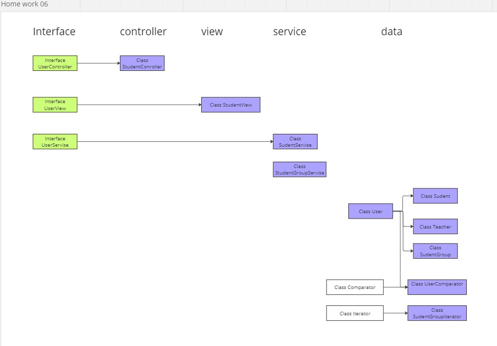

# Объектно-ориентированное программирование (семинары)
## Урок 6. ООП Дизайн и Solid
Взять реализованный код в рамках семинара 4 и продемонстрировать применение принципов, усвоенных на семинаре.
Нужно в проекте прокомментировать участки кода, которые рефакторим, какой принцип применяем и почему.

Формат сдачи: ссылка на гитхаб проект

---

Принципы SOLID 

S - Единственная ответственность (Single Responsibility Principle)

Каждый класс или метод должен иметь только одну ответственность. Это означает, что он должен выполнять только одну задачу и делать это хорошо.

O - Открытость/закрытость (Open/Closed Principle)

Программные сущности (классы, методы и т.д.) должны быть открыты для расширения, но закрыты для модификации. Это означает, что можно добавлять новую функциональность, не изменяя существующий код.

L - Принцип подстановки Лисков (Liskov Substitution Principle)

Подклассы должны быть взаимозаменяемы со своими суперклассами. Это означает, что если вы ожидаете объект суперкласса, вы должны иметь возможность использовать объект подкласса без каких-либо проблем.

I - Интерфейсная сегрегация (Interface Segregation Principle)

Клиенты не должны зависеть от интерфейсов, которые они не используют. Это означает, что следует создавать узкие и конкретные интерфейсы, а не большие и общие.

D - Инверсия зависимостей (Dependency Inversion Principle)

Модули высокого уровня не должны зависеть от модулей низкого уровня. Вместо этого зависимости должны быть инвертированы, так что модули высокого уровня зависят от абстракций, а модули низкого уровня реализуют эти абстракции.

https://miro.com/welcomeonboard/Nk5KTFVCcm1MNVJmZnM3WjNvNVpPbnJ3Y3VhMGNDODdsc2NHVGY3enU2MjZlTDNDdTFhWFIxZjg0MHVFamRQSnwzNDU4NzY0NTI4MTQ3ODg1MTg4fDI=?share_link_id=707240731400

Пояснение выполнения:

S

Каждый из представленных классов имеет единственное назначение. 
* Классы отвечающие за создание сущностей. Не несут фукций сортировок и фильтрации.
* Классы выводяцие на экран выделены отдельно
* Класс взаимодействия с пользователем отденльно

O 

Открытость для добавления нового (свойства,метода), закрытость для изменения (приватность базовых методов)
* Реализованно наследование 
  * User-->Student
  * User-->Teacher
  * Student-->StudentGroup
* Возможно последующее добавление классов, например: 
  * User-->Security (Представитель службы охраны университета)
  * Teacher-->TempTeacher (Учитель на замену)

L

Наследник дополняет а не замещает базовый класс
* Реализовано во взаимодействии User-->Student, Студент наследует и использует поля базового класса
* Для более яркого примера: Предположим у class User есть метод   public LocalDate getDateOfBirth(). При этом в class Student мы не опишем этот и поставим заглушку в виде return null. Это действие нарушит принп "L".

I

Нельзя заставлять клиента интерфейса реализовывать методы которыми от не пользуется.
* Наши интерфейсы отображают работу одного направления 
  * UserView - отвечает за вывод
  * UserService - отвечает за создания "БД"
    * При этом клас StudentService имплементирующий UserService прегружает все методы (1шт) и использует.
    * Нет перегрузок, которые является заглушками (бесполезным кодом)

D

Модули высокого уровня не зависят от модулей низкого уровня.
* Работу этого принципа показывает Interface UserService -> class StudentService
  * Если понадобится изменить взаимодействие с пользователем мы будем работать с Interface UserService -> class StudentService
  * Если понадобится Сервис для работы с данными учителей мы создадим Interface UserService -> class TeacherService

